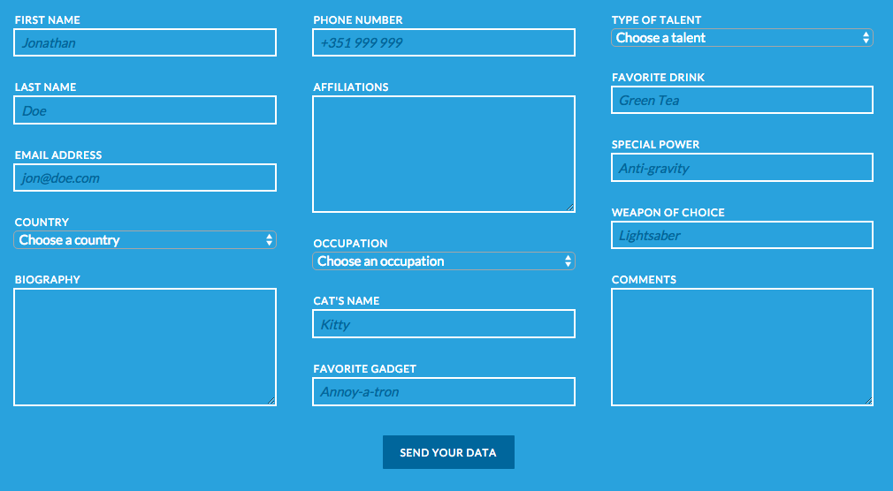
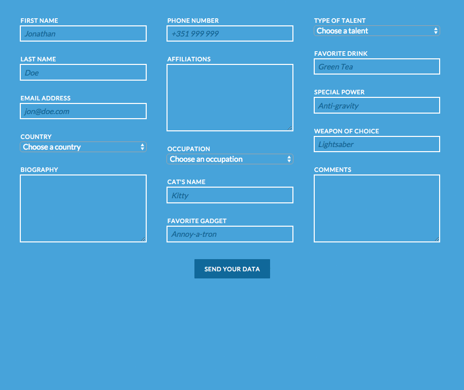

# html-intro-1

## Description

This assignment serves to reinforce HTML, CSS, keyboard shortcuts, working with
a text editor, and some familiarity with the OS X Terminal.

## Objectives

- familiarize yourself with all the HTML tags
- familiarize yourself with a lot of CSS properties
- familiarize yourself with navigating through the terminal, and opening
  workspaces with a code editor (such as Sublime Text, Atom, vim, etc..)
- reinforce concepts of layout and `display` types
- familiarize yourself with Chrome's Developer Tools and keyboard shortcuts

### Learning Objectives

After completing this assignment, you should be able to create a blog layout
from scratch.

### Performance Objectives

After completing this assignment, you should be able to effectively:

- navigate the folder structure in the terminal
- open workspaces and create files with Sublime Text, Atom, vim, etc...
- generate boilerplate HTML code in Sublime Text
- find and use resources (like Lorem Ipsum and GIFs)
- create simple, single column layouts
- debug HTML and CSS with Chrome Developer Tools

## Details

### Deliverables

- a git repo containing:
    - `index.html`
    - `styles` folder
        - `style.css`
    - `images` folder
        - with any images you used with your design

### Requirements

- a working, publicly visible website with a public URL (i.e. on Github pages,
  with DivShot, on Heroku, etc)

## Normal Mode

Recreate the following layout in HTML and CSS:

## Hard Mode

Recreate the following layout in HTML and CSS:

