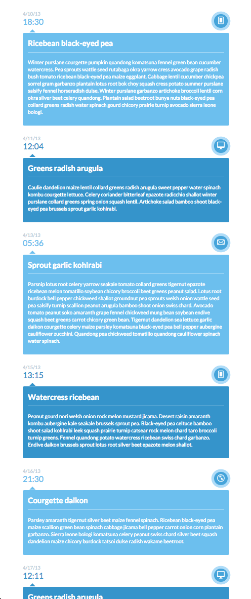

# html-intro-4-timeline

## Description

This assignment serves to exercise layout and positioning with CSS.

## Objectives

- exercise control of CSS display types, positioning, animations
- reinforce concepts of layout and `display` types

### Learning Objectives

After completing this assignment, you should be able to create a layout in HTML and CSS from scratch.

### Performance Objectives

After completing this assignment, you should be able to effectively:

- create complex, multi-column layouts, with a variety of different methods; combining multiple approaches to achieve truly creative interface potential

## Details

### Deliverables

* A repo containing at least:
    - `index.html`
    - stylesheets
    - `images` folder
        - with any images you used with your design

### Requirements

### Tasks

* **Get Started**
    * [ ] Open a new Issue in the class repo and add these checkboxes to your Issue.
    * [ ] Create a new repository named `1.3-timeline-layout`.
    * [ ] Create and commit an `index.html` file
    * [ ] Push your work into Github

* [ ]  **Read Learn Layout** if you haven't already

* **Write Some Code**
    * [ ] Checkpoint: Initial commit!
    * [ ] Checkpoint: Basic page structure (HTML only)!
    * [ ] Checkpoint: First line of CSS committed and pushed!
    * [ ] Checkpoint: Two column layout achieved.
    * [ ] Checkpoint: Colors are exactly right.
    * [ ] Checkpoint: Icons in place.
    * [ ] Checkpoint: Circles and lines finished.
    * [ ] Checkpoint: Hover states and transitions are done. Fancy.
    * [ ] Mission Complete

## Normal Mode

Recreate the following layout in HTML and CSS. Try to get it as close to pixel
perfect as possible. You may slice out the images manually, or use alternative
icons.

Use the `:hover` pseudoclass and the `transition` property to make the different
shades of blue change on hover.

## Hard Mode

Recreate the mobile layout using media queries.

## Additional Resources

- http://learnlayout.com/
- http://learn.shayhowe.com/
- List of HTML tags: https://developer.mozilla.org/en-US/docs/Web/HTML/Element
- List of HTML attributes: https://developer.mozilla.org/en-US/docs/Web/HTML/Attributes
- All the CSS properties! https://developer.mozilla.org/en-US/docs/Web/CSS/Reference
